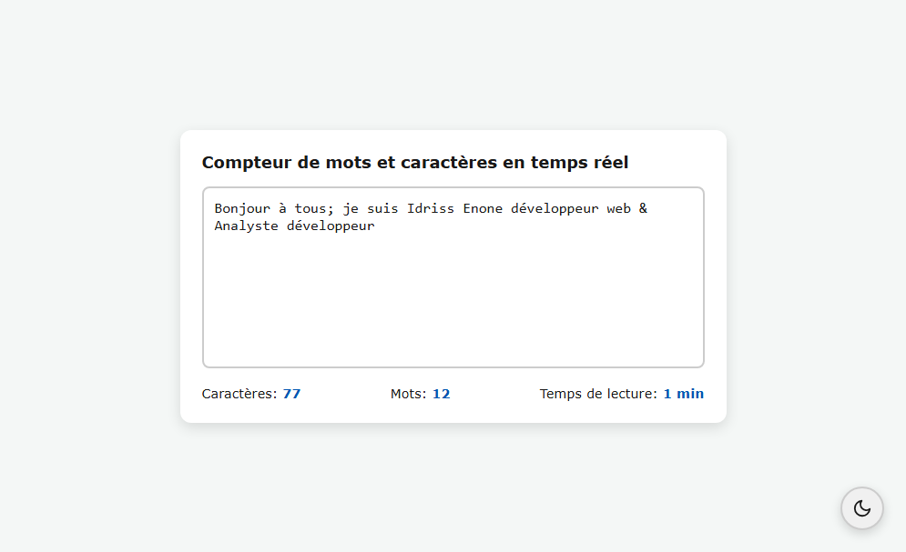
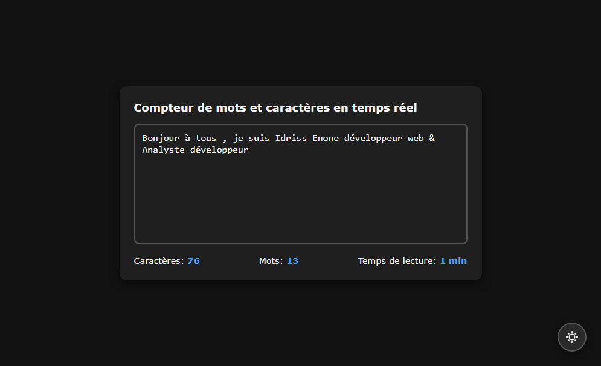
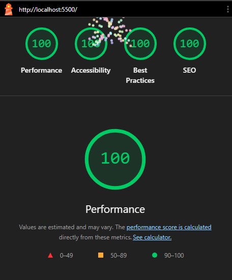

# 🔤 Real-Time Counter

Un compteur de texte en temps réel moderne, accessible et responsive, développé avec les technologies web natives (**HTML5**, **CSS3** et **JavaScript Vanilla**).

L'application analyse instantanément le texte saisi et fournit plusieurs statistiques utiles :

* Nombre de caractères
* Nombre de mots
* Temps de lecture estimé

Ce projet a été réalisé dans le but de mettre en pratique la manipulation du DOM, la gestion des événements JavaScript, le responsive design, l'accessibilité web et les principes du Clean Code.

---


## 🚀 Démonstration en ligne

🔗 **Application en ligne :**

  > [https://idriss-enone/real-time-counter](https://codepen.io/idriss-enone/full/VYmXEEK)


---


## 📸 Aperçu

### Mode clair



### Mode sombre



---

## ✨ Fonctionnalités

### Compteur de caractères

Affiche en temps réel le nombre total de caractères saisis.

### Compteur de mots

Calcule précisément le nombre de mots en ignorant :

* Les espaces multiples
* Les tabulations
* Les retours à la ligne

### Temps de lecture estimé

Fournit une estimation du temps de lecture basée sur une vitesse moyenne de lecture de :

**255 mots par minute**

### Mode clair / sombre

L'application propose :

* Un thème clair
* Un thème sombre
* La détection automatique des préférences système
* La sauvegarde du thème choisi via `localStorage`

### Responsive Design

 L'application utilise une approche Approche Mobile First afin de garantir une expérience optimale sur:

* Ordinateurs
* Tablettes
* Smartphones


---

## 🛠️ Technologies utilisées

### HTML5

* Structure sémantique
* Hiérarchie correcte des titres
* Formulaires accessibles
* Métadonnées SEO

### CSS3

* Variables CSS
* Flexbox
* Responsive Design
* Gestion des thèmes
* Gestion du focus clavier
* Animations et transitions

### JavaScript (ES6+)

* Manipulation du DOM
* Écouteurs d'événements
* Mise à jour dynamique de l'interface
* Gestion du thème utilisateur
* Persistance avec `localStorage`

---

## ♿ Accessibilité

L'application a été développée en suivant les recommandations **WCAG 2.1 niveau AA**.

### Bonnes pratiques implémentées

* Structure HTML sémantique
* Label associé au champ de saisie
* Texte d'aide relié via `aria-describedby`
* Zone dynamique annoncée via `aria-live="polite"`
* Navigation complète au clavier
* Focus visible avec `:focus-visible`
* Compatibilité avec les lecteurs d'écran
* Contrastes adaptés
* Support du mode sombre
* Prise en compte des préférences système via `prefers-color-scheme`

### Tests effectués

* Navigation clavier
* Vérification des contrastes
* Validation HTML
* Validation CSS
* Audit Lighthouse

---

## 🔍 Audit Lighthouse

Les performances et l'accessibilité du projet ont été vérifiées avec Lighthouse.

| Catégorie        | Score |
| ---------------- | ----- |
| Performance      | 100   |
| Accessibilité    | 100   |
| Bonnes pratiques | 100   |
| SEO              | 100   |

### Rapport



---

## 🧹 Clean Code

Le projet suit plusieurs principes de qualité logicielle :

### Séparation des responsabilités

* HTML → Structure
* CSS → Présentation
* JavaScript → Comportement

### Fonctions à responsabilité unique

Chaque fonction possède un rôle clairement défini :

* `getPostStats()`
* `updateReadingStats()`
* `initTheme()`
* `applyTheme()`

### Nommage explicite

Les variables et fonctions utilisent des noms clairs et descriptifs.

### Réutilisabilité

La logique métier est encapsulée dans des fonctions réutilisables.

### Maintenabilité

Le code est organisé, commenté lorsque nécessaire et facilement extensible.

---

## 🚀 Installation

### 1. Cloner le dépôt

```bash
git clone https://github.com/idriss-enone/real-time-counter.git
```

### 2. Accéder au projet

```bash
cd real-time-counter
```

### 3. Lancer l'application

Ouvrez simplement le fichier :

```text
index.html
```

dans votre navigateur préféré.

Aucune dépendance ni installation supplémentaire n'est requise.

---

## 📂 Structure du projet

```text
.
├── index.html                  # Structure de l'application  
├── styles.css                  # Styles et thèmes
├── script.js                   # Logique métier JavaScript  
├── assets/                     # Captures et rapports
│   ├── light-mode.png
│   ├── dark-mode.png
│   └── lighthouse-audit.png
└── README.md                   # Documentation du projet
```


---

## 🎯 Objectifs pédagogiques

Ce projet a permis de mettre en pratique :

* HTML sémantique
* CSS moderne
* Responsive Design
* Accessibilité Web
* JavaScript Vanilla
* Manipulation du DOM
* Gestion des événements
* Expressions régulières (Regex)
* Gestion du thème utilisateur
* Utilisation de `localStorage`
* Organisation d'un projet Front-End

---

## 📈 Axes d'amélioration

Fonctionnalités envisagées pour les prochaines versions :

* Compteur de phrases
* Compteur de paragraphes
* Temps de parole estimé
* Export du texte
* Statistiques avancées
* Analyse de lisibilité
* Comptage des caractères sans espaces
* Internationalisation (i18n)

---

## 🧪 Audit qualité

Avant publication, les vérifications suivantes ont été réalisées :

* Validation HTML
* Validation CSS
* Tests responsive
* Tests clavier
* Vérification des contrastes
* Audit Lighthouse
* Vérification du mode sombre
* Vérification des lecteurs d'écran

---


## Licence

Ce projet est distribué sous [licence MIT](https://opensource.org/license/MIT).

Vous êtes libre de :

* Utiliser
* Modifier
* Distribuer
* Adapter

le code selon les termes de la licence.


---

## Auteur

Je suis **Idriss Enone**.

---

⭐ N'hésitez pas à laisser une étoile au projet si vous le trouvez utile ou intéressant.
